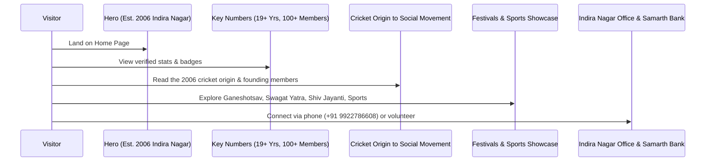

# Architecture & System Brain: Shree Pratishtan (श्री प्रतिष्ठान)

This document serves as the project's information architecture, logic engine, user journeys, navigation flow, CTA hierarchy, and content relationships of the **Shree Pratishtan** digital ecosystem.

---

## 1. Information Architecture (IA)

```mermaid
graph TD
    Root[Home Page] --> About[About Us & History]
    Root --> Events[Events & Festivals]
    Root --> Gallery[Media & Archives]
    Root --> Community[Social & Welfare Drives]
    Root --> Volunteer[Volunteer Onboarding]
    Root --> Contact[Contact & Support]

    About --> Founder[Adv. Shyam Badode Bio]
    About --> History[2006 Cricket Origin & 20 Founders]
    About --> Trust[Registration: nashik/0000153/2018]
    About --> Values[Bilingual Vision, Mission & Values]

    Events --> Cultural[Ganeshotsav & Navratri]
    Events --> Historical[Shiv Jayanti & Ambedkar Jayanti]
    Events --> Yatra[Gudipadwa Swagat Yatra]
    Events --> Sports[Sports & Cricket Tournaments]

    Community --> BloodDonation[Blood Donation Camps]
    Community --> YogaHealth[Yoga Day & Medical Camps]
    Community --> SocialCharity[Charitable & Civic Drives]

    Contact --> Bank[Samarth Sahakari Bank Info]
    Contact --> Office[Indira Nagar, Nashik Office]
```

### Hierarchy & Content Tree
1.  **Home Page**: High-impact brand introduction, verified stats (Est. 2006, 100+ members, 20 founders, 50+ drives), festival spotlights, and direct onboarding CTAs.
2.  **About Us**: 
    *   *The Origin Story*: How a daily cricket match in Indira Nagar in 2006 turned into a social welfare organization.
    *   *20 Founding Pillars*: Complete list of founding members.
    *   *Leadership Spotlight*: ॲड श्याम धर्मराज बडोदे (गटनेता तथा नगरसेवक प्रभाग क्र.३०, सरचिटणीस भाजपा नाशिक शहर).
    *   *Trust Credentials*: कै.धर्मराज बडोदे बहुउद्देशिय सेवाभावी संस्था (Reg: `nashik/0000153/2018`).
    *   *Bilingual Philosophy*: Marathi & English Vision, Mission, and 8 Core Values.
3.  **Events & Festivals**:
    *   *Cultural & Traditional*: Shree Ganeshotsav, Navratri Utsav, Gudipadwa Swagat Yatra.
    *   *Inspirational & Historical*: Chhatrapati Shivaji Maharaj Jayanti, Dr. Babasaheb Ambedkar Jayanti.
    *   *Sports & Youth*: Annual Cricket tournaments, athletic meets.
4.  **Social Initiatives & Community**:
    *   *Healthcare*: Mass Blood Donation Camps, International Yoga Day, Medical checkup drives.
    *   *Charity & Civic*: Environmental cleanliness, community welfare, student support.
5.  **Gallery**:
    *   Photo & Video archives of past festivals, cricket matches, felicitation ceremonies, and press coverage.
6.  **Volunteer Portal**: Structured onboarding for youth, event volunteers, and membership inquiries.
7.  **Contact & Banking**:
    *   Official address (Indira Nagar, Nashik), Phone (`+91 9922786608`), Email (`Info@shreepratishthan.com`), and Samarth Bank donation verification.

---

## 2. User Personas

### Persona A: Local Indira Nagar Youth / Sports Volunteer (20 yrs)
*   **Goal**: Participate in the annual cricket tournament, volunteer during Ganeshotsav or Gudipadwa Swagat Yatra.
*   **Need**: Fast, mobile-first event schedule, seamless volunteer form, and direct WhatsApp / phone contact.

### Persona B: Community Resident & Family Member (45 yrs)
*   **Goal**: Attend cultural programs, participate in Yoga Day, or find blood donation camp details.
*   **Need**: Clear Marathi/English notices, dates, venue locations in Indira Nagar, and helpline numbers.

### Persona C: Donors & Institutional Partners
*   **Goal**: Verify trust legitimacy and contribute funds or sponsor community tournaments.
*   **Need**: Registration details (`nashik/0000153/2018`), bank account credentials (Samarth Sahakari Bank), and transparent leadership credentials (Adv. Shyam Badode).

---

## 3. Navigation & CTA Conversion Matrix

| Entry Point | Primary Action | Secondary Action | Objective |
| :--- | :--- | :--- | :--- |
| **Hero Landing** | "Explore Our 19-Year Journey" | "Join as Volunteer" | Immediate engagement with history & member recruitment. |
| **Events Hub** | "View Event Details & Schedule" | "Participate / Register" | Cultural and sports participation. |
| **About Us Section** | "View 20 Founding Pillars" | "Contact Leadership" | Trust credibility and legacy building. |
| **Community Section**| "Register for Blood Camp" | "Donate via Samarth Bank" | High-impact social action & donations. |
| **Footer** | "Call: +91 9922786608" | "Email Us" | Direct communication with Indira Nagar team. |

---

## 4. Scroll Journey & Content Flow

