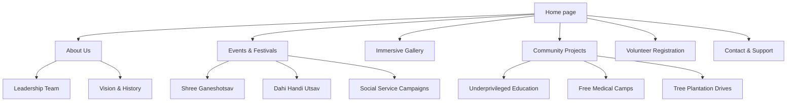
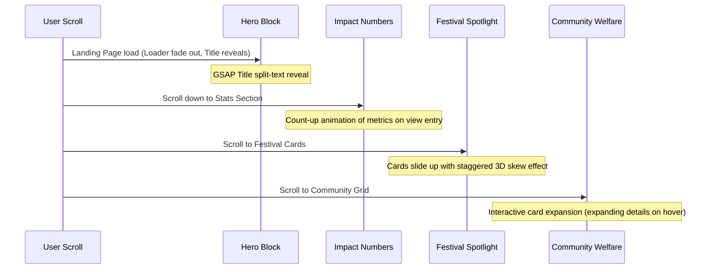

# Architecture & System Brain: Shree Prathishthan

This document serves as the project's logic engine. It diagrams the information architecture, user journeys, navigation flow, CTA hierarchy, and content relationships of the **Shree Prathishthan** digital ecosystem.

---

## 1. Information Architecture (IA)

### Hierarchy & Content Tree
1.  **Home Page**: Immersive introduction, current highlights, dynamic stats, core focus areas, and high-conversion calls to action.
2.  **About Us**: The founding story, values of the trust, organizational structure, and credentials.
3.  **Events & Festivals**: The dual operational pillar:
    *   *Cultural Pageantry*: Shree Ganeshotsav, Dahi Handi.
    *   *Social Drives*: Blood donations, disaster relief, health checkups.
4.  **Immersive Gallery**: High-definition media, historical highlights, press releases, and social media feeds.
5.  **Community Work**: Detailed case studies of our ongoing programs, showing metrics, stories of change, and future targets.
6.  **Volunteer Portal**: Structured onboarding pipeline for new community members.
7.  **Contact**: Visual forms, interactive map, details of administrative centers, and social channels.

---

## 2. User Personas

### Persona A: The Passionate Youth Volunteer (Rohan, 22)
*   **Goal**: Wants to find a trustworthy local platform to contribute to community welfare, specifically during major festivals.
*   **Need**: Fast, mobile-first registration, immediate visual proof of the organization's authenticity, and clear descriptions of task allocations.
*   **Behavior**: High usage of smartphones, prefers short, engaging videos, expects zero friction.

### Persona B: The Corporate CSR Manager (Anjali, 38)
*   **Goal**: Wants to partner with a credible trust for corporate social responsibility funds.
*   **Need**: Data-driven impact metrics, clean layout, structural accountability documentation, and transparent leadership profiles.
*   **Behavior**: Desktops and tablets, prints PDF summaries, values high-quality UI reflecting organizational capability.

### Persona C: The Community Beneficiary / Elder (Suresh, 61)
*   **Goal**: Needs to locate local healthcare drives and aid programs.
*   **Need**: Large, highly readable text, straightforward navigation, simple phone contact channels, and localized language pointers.

---

## 3. Navigation & Interaction Logic

### Navigation Rules
*   **Global Sticky Navbar**: Glassmorphic, 12% black opacity blur, slides up on scroll down, slides down on scroll up (preventing view occlusion).
*   **Responsive Burger Menu**: Screen overlay, custom GSAP stagger menu links with smooth spring physics.
*   **Stateful Indicators**: Current page highlighted with a subtle glowing dot matching the primary theme accent.

### CTA Conversion Matrix
| Entry Point | Primary Action | Secondary Action | Objective |
| :--- | :--- | :--- | :--- |
| **Hero Landing** | "Explore Our Work" (Scroll trigger) | "Become a Volunteer" (Direct Form) | High engagement and immediate volunteer onboarding. |
| **Festival Segment**| "View Event Gallery" | "Read Impact Report" | Brand storytelling and social proofing. |
| **Community Section**| "Support This Project" | "Browse All Initiatives" | Direct corporate/individual donations and trust validation. |
| **About Us Footer** | "Contact Leadership" | "Register as Volunteer" | Trust validation and stakeholder query routing. |

---

## 4. Scroll Journey & Animation Sequence (Home Page)

---

## 5. Event & Content Relationships

*   **Festivals Feed Welfare**: Cultural celebrations like Ganeshotsav act as massive gathering points to collect donations, enroll volunteers, and raise awareness for social drives.
*   **Data Aggregation**: Every project completed in `Community` dynamically feeds metrics shown in the `Stats` components of the Home page (e.g. "Litres of blood donated," "Underprivileged kids supported").
*   **Volunteer Funnel**: Every registration page routes profiles to specific project database tags (e.g. Rohan signs up -> tags: "Ganeshotsav-Logistics", "MedicalCamp-Volunteer").
