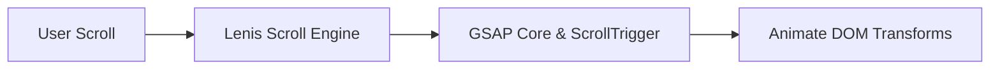

# Technology Stack & Performance: Shree Prathishthan

This document details our architectural choices, third-party libraries, media strategies, and optimization rules for the **Shree Prathishthan** production build.

---

## 1. Core Framework & Base Environment

*   **Runtime & Meta-framework**: Next.js v16.2.12 (using the modern App Router).
*   **Engine**: React v19.2.4 with TypeScript (v5) providing compile-time type safety.
*   **CSS Architecture**: Tailwind CSS v4. Standardizes layout configurations, border radii, color systems, and responsiveness rules.
*   **State Management**: React Context APIs for theme configurations and form states; standard `useState`/`useActionState` hooks for interactive elements.

---

## 2. Animation & Interaction Libraries

We use dedicated libraries to ensure smooth rendering and custom ease curves.



### GSAP (GreenSock Animation Platform)
*   *Purpose*: Entrance sequences, split-text letters, scroll-linked elements, and 3D pointer tracking.
*   *Plugins*: `ScrollTrigger` for viewport interactions.
*   *Constraint*: Always install GSAP locally. Do not use external scripts in the DOM.

### Lenis Scroll Engine
*   *Purpose*: Unified smooth scrolling across browser environments.
*   *Integration*: Configured inside a global Layout Provider component.

### Framer Motion
*   *Purpose*: Micro-transitions on the client side, such as expand/collapse accordions and slide-over menu panels.
*   *Usage Rule*: Keep occurrences minimal to avoid bundle bloat.

---

## 3. Media & Optimization Strategies

### Next.js Image Component
*   All images must render through the Next.js `<Image />` component.
*   Set explicit dimension bounds (`width` and `height`) to prevent layout shifts.
*   Load critical landing images with `priority={true}` to speed up LCP times.

### WebP/AVIF Asset Delivery
*   Static images inside the public directory must be pre-compressed using WebP or AVIF formats.
*   Avoid deploying raw PNG or JPEG files above `200KB` in size.

### Inline Vector Graphics (SVGs)
*   Icons and decorative ornaments must be implemented as clean inline vectors or React icons (`lucide-react`) to prevent layout lag.

---

## 4. Code Splitting & Dynamic Loading

*   **Dynamic Component Imports**:
    *   Interactive maps, complex forms, and canvas loaders must be imported using Next.js `dynamic()` to delay loading code that is not immediately visible.
```typescript
import dynamic from 'next/dynamic';

const InteractiveMap = dynamic(
  () => import('@/components/ui/Map'),
  { ssr: false, loading: () => <SkeletonMap /> }
);
```

*   **Route-based Code Splitting**: Managed automatically by the Next.js compiler.

---

## 5. Deployment & Vercel Pipeline

*   **Repository Hosting**: GitHub.
*   **Production Deployment Server**: Vercel (recommended for App Router optimization).
*   **Asset Delivery System**: Next.js Edge CDN network for low-latency asset serving.
*   **Pre-flight Checks**: Production pipelines run lint inspections (`next lint`), type checks (`tsc`), and package builds (`next build`) to ensure build integrity.
