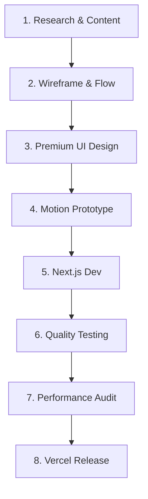

# Production Workflow: Shree Prathishthan

This document details the step-by-step pipeline for designing, prototyping, coding, testing, and deploying updates within the **Shree Prathishthan** ecosystem.

---

## 1. The Production Pipeline

---

## 2. Pipeline Phase Details

### Phase 1: Research & Content Mapping
*   **Action**: Coordinate with trust coordinators to collect text materials, statistics, and high-definition media assets.
*   **Result**: Copy elements are placed in [docs/content.md](file:///d:/Shri%20Pratisthan/docs/content.md) and asset logs are logged in [docs/assets.md](file:///d:/Shri%20Pratisthan/docs/assets.md) before writing code.

### Phase 2: Wireframe & User Flows
*   **Action**: Sketch visual section hierarchies and structure navigation journeys.
*   **Result**: Structural pathways are updated in the project logic brain ([docs/brain.md](file:///d:/Shri%20Pratisthan/docs/brain.md)).

### Phase 3: Premium UI Design
*   **Action**: Create high-fidelity mockups in design tools (Figma). Use dark backgrounds, saffron glow accents, and glass cards.
*   **Result**: Update design tokens inside the master design guidelines ([docs/design-system.md](file:///d:/Shri%20Pratisthan/docs/design-system.md)).

### Phase 4: Motion Prototyping
*   **Action**: Map out transition timelines, micro-interactions, scroll offsets, and cursor behaviors.
*   **Result**: Write animation scripts and GSAP configurations in the motion system guidelines ([docs/animation.md](file:///d:/Shri%20Pratisthan/docs/animation.md)).

### Phase 5: Next.js Development
*   **Action**: Write clean TypeScript components.
    *   Build layout grids, set up fonts, and apply global styles.
    *   Implement client components and initialize scroll engines.
    *   Integrate GSAP ScrollTriggers and motion components.

### Phase 6: Quality & Validation Testing
*   **Action**: Test application functionality:
    *   *Visual Integrity*: Verify layouts across mobile, tablet, and widescreen viewports.
    *   *Interaction Testing*: Check keyboard navigation and ARIA roles for accessibility.
    *   *Functional Verification*: Validate volunteer forms and error handling.

### Phase 7: Performance Audit (Lighthouse)
*   **Action**: Run Lighthouse performance audits:
    *   Ensure Largest Contentful Paint (LCP) is under `1.5` seconds.
    *   Verify Cumulative Layout Shift (CLS) remains at `0.0`.
    *   Confirm images are optimized and code bundles are split.

### Phase 8: Deployment & CI/CD Release
*   **Action**: Commit changes to Git. Push to master branch to trigger Vercel's automated build and edge CDN distribution.
